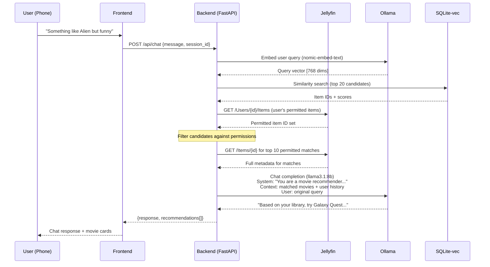
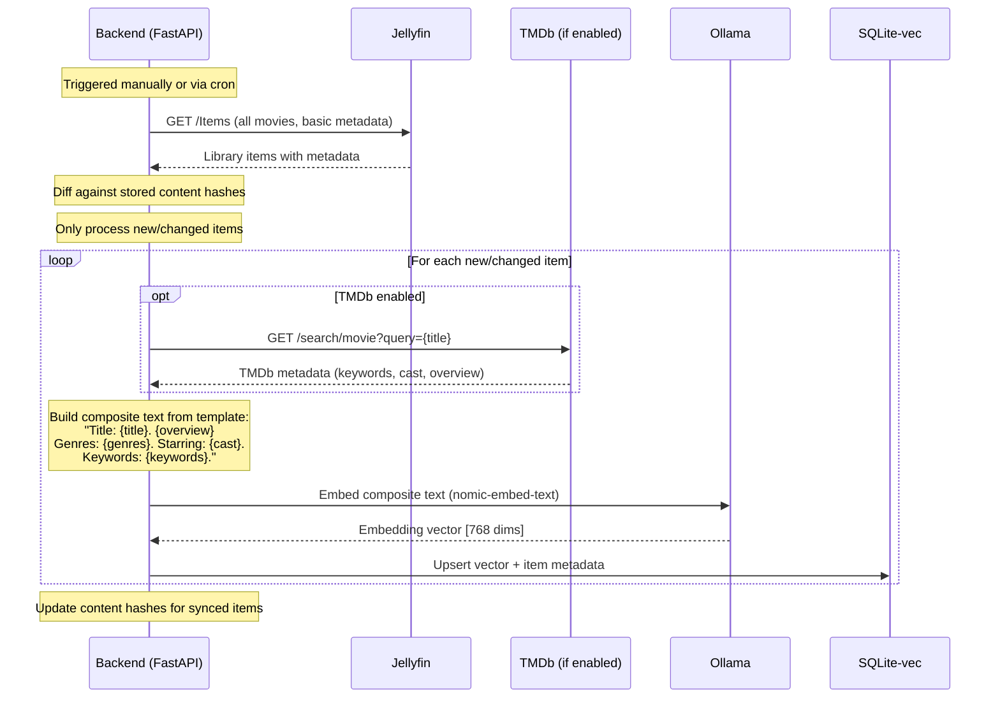

# Architecture

## System Overview

ai-movie-suggester is a self-hosted RAG (Retrieval-Augmented Generation) application that provides conversational movie recommendations from a user's Jellyfin library.

```mermaid
graph TB
    subgraph User Devices
        phone[Phone / Browser]
        tv[TV / Streaming Device]
    end

    subgraph Docker Compose Stack
        frontend[Next.js Frontend<br/>PWA, Mobile-First]
        backend[FastAPI Backend<br/>RAG Orchestrator]
        sqlite[(SQLite-vec<br/>Embeddings + App Data)]
    end

    subgraph External Services — User's Network
        jellyfin[Jellyfin Server<br/>Media + Auth + Permissions]
        ollama[Ollama<br/>LLM + Embeddings]
    end

    subgraph Optional External — Opt-in Only
        tmdb[TMDb API<br/>Metadata Enrichment]
    end

    phone -->|HTTPS| frontend
    frontend -->|API calls| backend
    backend -->|Queries + Auth| jellyfin
    backend -->|Inference| ollama
    backend -->|Read/Write| sqlite
    backend -.->|If enabled| tmdb
    backend -->|Play command| jellyfin
    jellyfin -->|Stream| tv
```

## Data Flow: Recommendation Query



## Data Flow: Library Sync & Embedding



## Component Responsibilities

### Backend (FastAPI)
- **Auth proxy**: Authenticates users against Jellyfin, manages server-side sessions
- **RAG orchestrator**: Coordinates embedding generation, vector search, and LLM chat
- **Ollama queue**: Serializes access to Ollama; chat preempts embedding batches
- **Permission filter**: Queries Jellyfin for user's permitted items, filters vector results
- **Sync engine**: Incremental library sync with content-hash tracking
- **Health reporting**: `/health` endpoint for Jellyfin, Ollama, and embedding status

### Frontend (Next.js)
- **Chat interface**: Conversational UI for recommendations
- **Movie cards**: Display recommendations with metadata and poster art
- **Session manager** (Epic 4): Device picker for "Play on TV"
- **PWA shell**: Installable, mobile-first, works on phone-as-remote use case

### SQLite-vec
- **Vector storage**: 768-dimensional embeddings for library items
- **App data**: Content hashes, sync timestamps, embedding metadata
- **Access pattern**: WAL mode, separate read/write connection pools
- **Abstraction**: Behind a repository interface for potential future swap

### Ollama
- **Embedding model**: `nomic-embed-text` for library indexing
- **Chat model**: `llama3.1:8b` for conversational recommendations
- **Deployment**: Either bundled sidecar or user's existing instance
- **Constraint**: Single-model-at-a-time on consumer GPUs; app manages queue

## Security Model

- **Authentication**: Jellyfin is the identity provider. No separate user accounts.
- **Token handling**: Jellyfin AccessTokens stored in server-side encrypted sessions only. Tokens are never persisted unencrypted to disk — tokens are encrypted at rest in the session table using Fernet with HKDF-derived keys. Never exposed to frontend.
- **Session expiry**: Configurable (default 24h). Logout revokes Jellyfin token.
- **Permissions**: Enforced at query time via Jellyfin's API. Vector DB is not a security boundary.
- **Network**: Backend binds to 127.0.0.1 by default. External access via existing reverse proxy (Caddy).
- **Privacy**: All AI inference is local. TMDb enrichment is opt-in with documented data disclosure.
- **API hardening**: CORS restricted to frontend origin. `/docs` disabled in production. Rate limiting on chat endpoint. Security headers via middleware.

## Configuration

All configuration via environment variables (`.env` file). See `.env.example` for documentation.

| Category | Variables | Required |
|----------|----------|----------|
| Jellyfin | `JELLYFIN_URL` | Yes |
| Sessions | `SESSION_SECRET` | Yes |
| Ollama | `OLLAMA_HOST`, `OLLAMA_CHAT_MODEL`, `OLLAMA_EMBED_MODEL` | Defaults provided |
| TMDb | `TMDB_ENABLED`, `TMDB_API_KEY` | No (opt-in) |
| Tuning | `LOG_LEVEL`, `SESSION_EXPIRY_HOURS`, `CHAT_RATE_LIMIT` | No (defaults provided) |

## Deployment Models

### Standalone (new Ollama user)
```bash
docker compose -f docker-compose.yml -f docker-compose.ollama.yml up -d
```

### Existing Ollama
```bash
# Set OLLAMA_HOST in .env to your instance
docker compose up -d
```

### Development
```bash
make dev       # full stack with hot reload
make dev-ui    # frontend only
```

## Epic Roadmap

| Epic | Scope | Dependencies |
|------|-------|-------------|
| 1. Scaffolding & Auth | Docker Compose, Jellyfin auth, multi-user sessions | None |
| 2. Semantic Brain | Library sync, embedding pipeline, semantic search API | Epic 1 |
| 3. Conversational Discovery | Chat UI, RAG pipeline, history-biased ranking | Epic 2 |
| 4. Remote Control | Session detection, "Play on TV" trigger | Epic 3 |

Build order: Epic 1 → 2 → 3 → 4 (sequential, not parallel).
