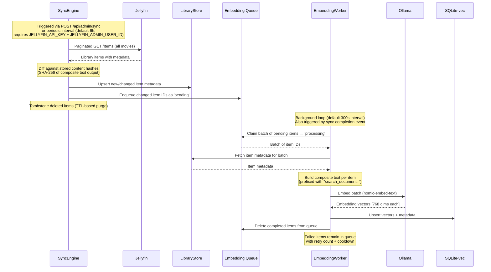
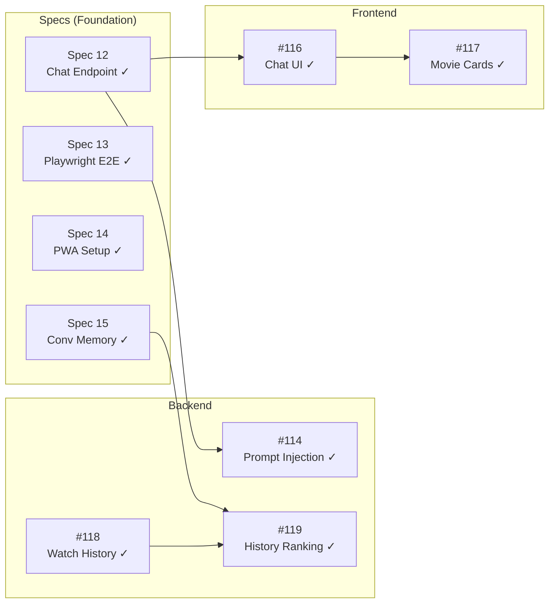
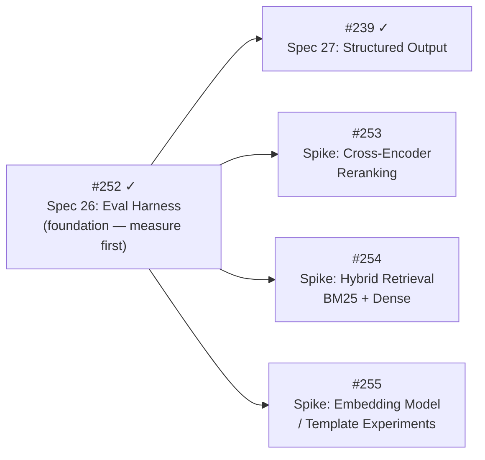

# Architecture

## System Overview

ai-movie-suggester is a self-hosted RAG (Retrieval-Augmented Generation) application that provides conversational movie recommendations from a user's Jellyfin library.

```mermaid
graph TB
    subgraph User Devices
        phone[Phone / Browser]
        tv[TV / Streaming Device]
    end

    subgraph Docker Compose Stack
        frontend[Next.js Frontend<br/>PWA, Mobile-First]
        backend[FastAPI Backend<br/>RAG Orchestrator]
        sqlite[(SQLite-vec<br/>Embeddings + App Data)]
    end

    subgraph External Services — User's Network
        jellyfin[Jellyfin Server<br/>Media + Auth + Permissions]
        ollama[Ollama<br/>LLM + Embeddings]
    end

    phone -->|HTTPS| frontend
    frontend -->|API calls| backend
    backend -->|Queries + Auth| jellyfin
    backend -->|Inference| ollama
    backend -->|Read/Write| sqlite
    backend -->|Play command| jellyfin
    jellyfin -->|Stream| tv
```

## Data Flow: Recommendation Query

```mermaid
sequenceDiagram
    participant U as User (Phone)
    participant F as Frontend
    participant B as Backend (FastAPI)
    participant J as Jellyfin
    participant O as Ollama
    participant V as SQLite-vec
    participant L as LibraryStore
    participant C as ConversationStore

    U->>F: "Something like Alien but funny"
    F->>B: POST /api/chat {message}
    Note over B: User identity from encrypted session cookie;<br/>conversation keyed by session ID
    B->>C: Load history + store user turn (under lock)
    C-->>B: Previous turns + updated turn count
    B->>O: Embed user query (nomic-embed-text)
    Note over B: Query prefixed with "search_query: "
    O-->>B: Query vector [768 dims]
    B->>V: Similarity search (limit × overfetch_multiplier candidates)
    V-->>B: Item IDs + similarity scores
    B->>J: Fetch permitted item IDs (TTL-cached, ~5min)
    J-->>B: Permitted item ID set
    Note over B: Filter candidates against permissions
    B->>L: get_many() for top permitted matches
    L-->>B: Full metadata from local SQLite
    Note over B: If candidates are empty, emit graceful<br/>text + done and skip Ollama (Spec 25)
    B-->>F: SSE: metadata event (version 2, candidates + search_status)
    B-->>F: SSE: status event (generating)
    B->>O: Structured chat (llama3.1:8b) — Ollama `format` JSON schema,<br/>temperature 0, non-streaming (Spec 27).<br/>System prompt (+ schema) + history + [ID:] candidate context + query
    Note over B: Cooperative GPU pause: embedding worker<br/>yields GPU while chat is active
    O-->>B: Grammar-constrained JSON payload<br/>{introductory_message, recommendations[{jellyfin_id, reasoning}]}
    Note over B: Validate each jellyfin_id against the candidate set;<br/>drop hallucinated ids. Zero valid / parse error / timeout<br/>→ canned fallback (text + done, no picks event)
    B-->>F: SSE: picks event (validated, 1-based order)
    B-->>F: SSE: text (prose synthesized from picks) → done
    B->>C: Store assistant turn + structured sidecar (under lock)
    F-->>U: Cards + prose from one validated payload (cannot diverge)
```

### Chat SSE event contract (Spec 27, version 2)

The `metadata` event carries `version: 2`. Events are additive over the v1
contract, so a v1 frontend ignores unknown event types and still works:

- `metadata` — `{version: 2, recommendations: SearchResultItem[], search_status, turn_count}` (all candidates; instant)
- `status` — `{phase: "generating"}` (staged wait state; emitted when generation begins)
- `picks` — `{version: 2, picks: [{jellyfin_id, reasoning, pick_order}]}` (validated recommendations, LLM order; **absent on the fallback path**)
- `text` — `{content}` (prose synthesized deterministically from the picks; one event, not token-streamed)
- `done` — stream complete
- `error` — only for pre-search failures (`search_unavailable`); generation failures degrade to the canned-text fallback, never an error event

Generation is non-streaming (grammar-constrained decoding produces the whole
payload at once), so the 120s chat timeout now bounds a single blocking call;
the `status` event is the user-facing mitigation.

## Data Flow: Library Sync & Embedding

Sync and embedding are **decoupled**. The sync engine discovers changes and enqueues items; the embedding worker processes the queue asynchronously.



## Component Responsibilities

### Backend (FastAPI)
- **Auth proxy**: Authenticates users against Jellyfin, manages server-side sessions with encrypted tokens
- **RAG orchestrator**: Coordinates embedding generation, vector search, conversation history, and LLM chat
- **Search service**: Embeds queries, performs vector similarity search, filters by permissions, enriches with metadata
- **Conversation store**: In-memory multi-turn conversation history with TTL (2h), LRU eviction, and per-session locking. Intentionally not persisted to disk — chat messages are PII.
- **Embedding worker**: Background task that processes the embedding queue in batches with retry logic, template version detection, and cooldown-based error handling
- **Cooperative GPU pause**: Chat requests signal the embedding worker to yield via `asyncio.Event`. Not a queue — the worker voluntarily skips its cycle while chat is active.
- **Permission service**: In-memory TTL-cached (5min) set of user's permitted Jellyfin items, using the user's own token (not admin key). Cache invalidated on logout.
- **Sync engine**: Incremental library sync with content-hash tracking, tombstone-with-TTL for deletions, decoupled from embedding. Periodic sync uses `JELLYFIN_API_KEY` + `JELLYFIN_ADMIN_USER_ID` because Jellyfin's item enumeration endpoint is scoped to a user even with an API key.
- **Admin API**: `/api/admin/sync` (trigger sync), `/api/admin/embedding/status` (queue stats). Guarded by `require_admin`.
- **Health reporting**: `/health` endpoint for Jellyfin, Ollama, embedding status, and library sync status

### Frontend (Next.js)
- **Auth UI**: Login page, route protection (middleware + RSC layout guard), auth context, logout
- **Chat interface** (Epic 3): Conversational UI for recommendations — SSE-streamed chat with multi-turn conversation memory
- **Movie cards** (Epic 3): Display recommendations with metadata and poster art, with an expandable detail view
- **Session manager** (Epic 4): Device picker and "Play on TV" dispatch
- **PWA shell**: Installable, mobile-first, manual service worker with cache-first static shell. `minimal-ui` display mode. Install banner mounted in the protected layout.

### SQLite-vec / SQLite Databases
The application uses a two-file database strategy:
- **`data/sessions.db`**: Auth/session data — encrypted tokens, CSRF, expiry. Small rows, frequent read/write. Managed by `SessionStore`. Plain SQLite.
- **`data/library.db`**: Library item metadata, vector embeddings, embedding queue, and sync history. Large batch writes during sync, read-heavy during search. Managed by `LibraryStore` + `SqliteVecRepository`. Uses SQLite-vec extension.

Tables in `library.db`:
- `library_items` — titles, genres, content hashes, metadata
- `item_vectors` — vec0 virtual table, 768-dimensional embeddings with metadata columns
- `embedding_queue` — pending/processing/failed items for the embedding worker
- `sync_runs` — sync execution history
- `_vec_meta` — model name, dimensions, and composite-text template version. If the template used to build embedding input strings changes, previously stored vectors are considered stale and re-queued

Rationale: Different access patterns (sessions are small/frequent; library is large/batch), different backup and migration lifecycles. Both use WAL mode (PASSIVE checkpoint) and aiosqlite. `SqliteVecRepository` uses separate reader and writer connections for concurrent search-while-embedding without write lock contention.

- **Conversation history**: Intentionally in-memory only (Python dicts + deques in `ConversationStore`). Not persisted to either database — conversations are ephemeral and lost on backend restart. This is a deliberate privacy decision: persisting chat messages would constitute logging PII.
- **Abstraction**: Behind repository interfaces (`SessionStoreProtocol`, `LibraryStoreProtocol`) for potential future swap
- **vec0 limitations**: The SQLite-vec virtual table does not enforce UNIQUE or NOT NULL constraints, does not participate in foreign keys, does not support INSERT OR REPLACE, and rejects NULL/empty vectors. The repository works around these with DELETE+INSERT upsert in explicit transactions, application-level referential integrity, and the separate `embedding_queue` table (since vec0 rejects NULL vectors for items not yet embedded).
- **Migration strategy**: Schema creation uses `CREATE TABLE IF NOT EXISTS`. No migration framework is in place — schema changes must be additive or require a fresh database.

### Ollama
- **Embedding model**: `nomic-embed-text` for library indexing (uses asymmetric `search_document:` / `search_query:` prefixes)
- **Chat model**: `llama3.1:8b` for conversational recommendations
- **Split clients**: `OllamaEmbeddingClient` (120s timeout, batch support) and `OllamaChatClient` (300s timeout; `chat_stream` for legacy streaming + `chat_structured` for grammar-constrained JSON via `format`, Spec 27) — separate classes due to different I/O contracts
- **Deployment**: Either bundled sidecar or user's existing instance
- **Constraint**: Single-model-at-a-time on consumer GPUs; cooperative GPU pause yields to chat when both are active

## Security Model

- **Authentication**: Jellyfin is the identity provider. No separate user accounts.
- **Token handling**: Jellyfin AccessTokens stored in server-side encrypted sessions only. Tokens are never persisted unencrypted to disk — tokens are encrypted at rest in the session table using Fernet with HKDF-derived keys. Never exposed to frontend.
- **CSRF protection**: Double-Submit pattern — state-changing requests require `X-CSRF-Token` header matching the `csrf_token` cookie. Login is exempt. Combined with `SameSite=Lax` for defense-in-depth.
- **Session expiry**: Configurable (default 24h). Logout revokes Jellyfin token, purges conversation history, and invalidates the permission cache for that user.
- **Permissions**: Enforced at query time via Jellyfin's API with in-memory TTL cache (~5min). Vector DB is not a security boundary. Permission service uses the user's own token, not the admin API key.
- **Network**: Docker Compose maps backend port to `127.0.0.1:8000`. External access via existing reverse proxy (Caddy).
- **Privacy**: All AI inference is local. Conversation history is in-memory only — never persisted to disk (PII constraint). No outbound calls to third-party metadata services — movie metadata comes from Jellyfin only.
- **API hardening**: CORS restricted to frontend origin. `/docs` disabled in production. Rate limiting on login (5/min), chat (10/min), and search (10/min) endpoints. Security headers via middleware. Request validation errors return HTTP 422 (FastAPI/Pydantic convention), not 400.
- **Prompt injection**: Structural mitigation via grammar-constrained output plus prompt separation. Spec 25 (#238) shipped the soft hardening (IDs in candidate context + strengthened system prompt + empty-result graceful path). **Spec 27 (#239) shipped the structural fix**: the LLM emits a JSON-schema-constrained payload (Ollama `format`), and the backend validates every `jellyfin_id` against the permission-filtered candidate set — the model can no longer fabricate a recommendation or smuggle one in via metadata, because card identity comes only from validated ids, not free text. Residual surface: the `reasoning`/`introductory_message` free-text fields remain attacker-influenceable (via crafted metadata) and are rendered through the sanitized markdown path — a severity reduction, not elimination. The fallback path is a canned message (never free-prose), so a forced structured-output failure cannot downgrade to the soft-prompt-only surface.
- **Service worker**: Cache-first for static shell only. No API response or image caching — cross-user data leakage risk on shared household devices.
- **Credential distinction**: Two types of Jellyfin credentials are used, with different handling:
  - **User tokens** (per-session): Encrypted at rest in `sessions.db` using Fernet with HKDF-derived keys. Never persisted to objects, never logged. Request-scoped — passed as parameters, not stored on instances.
  - **Infrastructure API key** (`JELLYFIN_API_KEY`): Operator-configured, server-scoped. Enables background library sync without a logged-in user session. Loaded once at startup from environment. Never logged at any level. Strict code-path isolation from user-facing code. Treat like a root password.

## Configuration

All configuration via environment variables (`.env` file). See `.env.example` for full documentation.

| Category | Variables | Required |
|----------|----------|----------|
| Jellyfin | `JELLYFIN_URL`, `JELLYFIN_TIMEOUT` | `JELLYFIN_URL` required |
| Sessions | `SESSION_SECRET`, `SESSION_SECURE_COOKIE`, `SESSION_EXPIRY_HOURS`, `SESSION_DB_PATH`, `MAX_SESSIONS_PER_USER` | `SESSION_SECRET` required |
| Security | `LOGIN_RATE_LIMIT`, `TRUSTED_PROXY_IPS`, `CORS_ORIGIN` | Defaults provided |
| Ollama | `OLLAMA_HOST`, `OLLAMA_CHAT_MODEL`, `OLLAMA_EMBED_MODEL`, `OLLAMA_EMBED_DIMENSIONS`, `OLLAMA_EMBED_TIMEOUT`, `OLLAMA_HEALTH_TIMEOUT` | Defaults provided |
| Library | `LIBRARY_DB_PATH` | Default: `data/library.db` |
| Permissions | `PERMISSION_CACHE_TTL_SECONDS` | Default: 300 |
| Sync | `JELLYFIN_API_KEY`, `JELLYFIN_ADMIN_USER_ID`, `LIBRARY_SYNC_PAGE_SIZE`, `SYNC_INTERVAL_HOURS`, `TOMBSTONE_TTL_DAYS`, `WAL_CHECKPOINT_THRESHOLD_MB` | `JELLYFIN_API_KEY` for background sync |
| Embedding | `EMBEDDING_BATCH_SIZE`, `EMBEDDING_WORKER_INTERVAL_SECONDS`, `EMBEDDING_MAX_RETRIES`, `EMBEDDING_COOLDOWN_SECONDS` | Defaults provided |
| Search | `SEARCH_RATE_LIMIT`, `SEARCH_OVERFETCH_MULTIPLIER`, `FOREIGN_FILM_HOME_COUNTRIES` | Defaults provided (`FOREIGN_FILM_HOME_COUNTRIES=US`; ISO 3166-1 alpha-2 codes; set empty to disable the foreign-film route) |
| Chat | `CHAT_RATE_LIMIT`, `CHAT_SYSTEM_PROMPT` | Defaults provided |
| Conversation | `CONVERSATION_MAX_TURNS`, `CONVERSATION_TTL_MINUTES`, `CONVERSATION_MAX_SESSIONS`, `CONVERSATION_CONTEXT_BUDGET` | Defaults provided |
| Tuning | `LOG_LEVEL`, `ENABLE_DOCS` | Defaults provided |

## Deployment Models

### Standalone (new Ollama user)
```bash
docker compose -f docker-compose.yml -f docker-compose.ollama.yml up -d
```

### Existing Ollama
```bash
# Set OLLAMA_HOST in .env to your instance
docker compose up -d
```

### Development
```bash
make dev       # full stack with hot reload (backend + frontend + Ollama)
make dev-ui    # frontend only (no Ollama needed)
```

### Integration Testing
```bash
make jellyfin-up          # start disposable Jellyfin container
make test-integration     # run integration tests (Jellyfin must be running)
make test-integration-full  # start Jellyfin, test, teardown
make jellyfin-down        # stop and remove test Jellyfin
```

The test suite uses `docker-compose.test.yml` to provision a disposable Jellyfin instance. First-run wizard and test user provisioning are automatic and idempotent.

## Epic Roadmap

| Epic | Scope | Specs | Status |
|------|-------|-------|--------|
| 0. AI-Native Foundation | Scaffolding, CI, editor config, pre-commit hooks | — | **Complete** |
| 1. Scaffolding & Auth | Docker Compose, Jellyfin auth, multi-user sessions, frontend auth UI | Specs 01–04 | **Complete** |
| 2. Semantic Brain | Library sync, embedding pipeline, semantic search API | Specs 05–11 | **Complete** |
| 3. Conversational Discovery | Chat endpoint, conversation memory, chat UI, movie cards, watch history ranking | Specs 12–15; #114, #116–#119 | **Complete** |
| 3.5. Validation — But Does It Work? | Pipeline validation, test media fixtures, real-inference checks | Specs 22–23; #190 (open) | **In Progress** |
| 4. Remote Control | Session/device detection, "Play on TV" trigger | #202, #203, #208, #212; test-infra tail #195 (open) | **Complete** |
| 5. Recommendation Quality & Evaluation | Eval harness, structured-output chat, reranking + hybrid retrieval spikes, embedding experiments | #252 ✓ (Spec 26), #239 ✓ (Spec 27); #253, #254, #255, #268 | **In Progress** |

Build order: Epic 0 → 1 → 2 → 3 → 3.5 → 4 → 5 (sequential, not parallel).

### Epic 3 Delivery

> Historical delivery map — all items shipped. Retained for dependency context.



### Epic 5 Dependency Order


